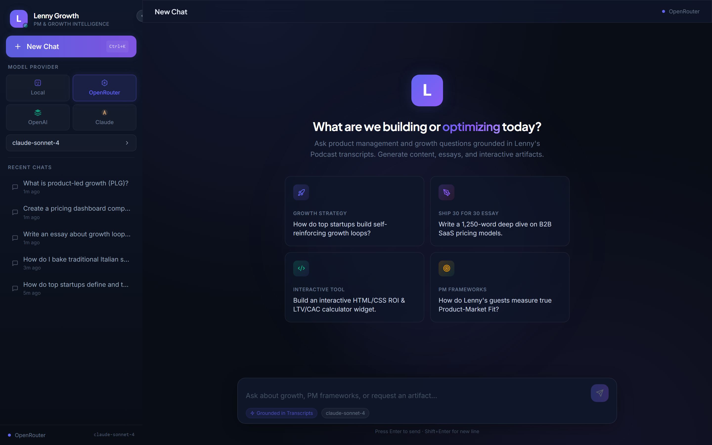
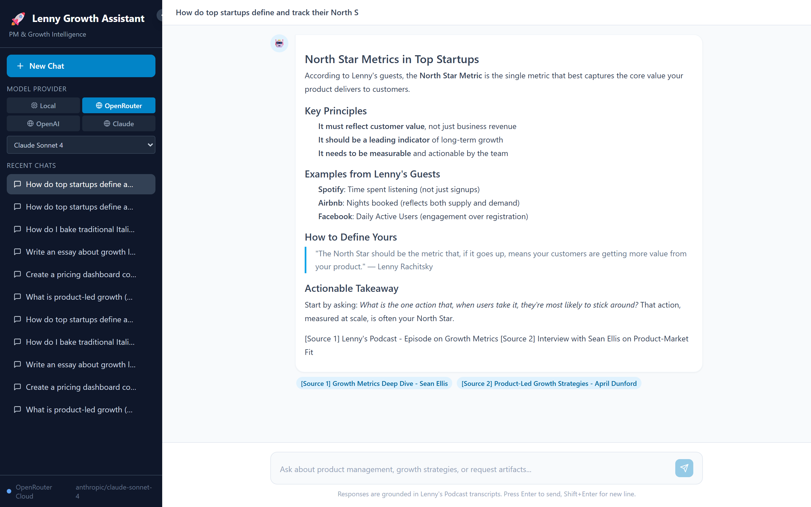
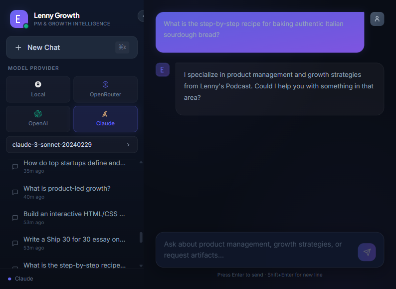
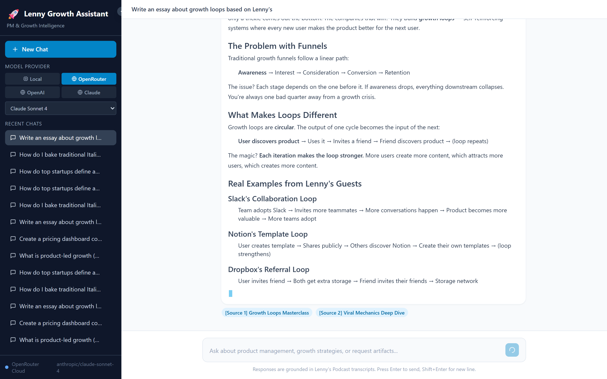
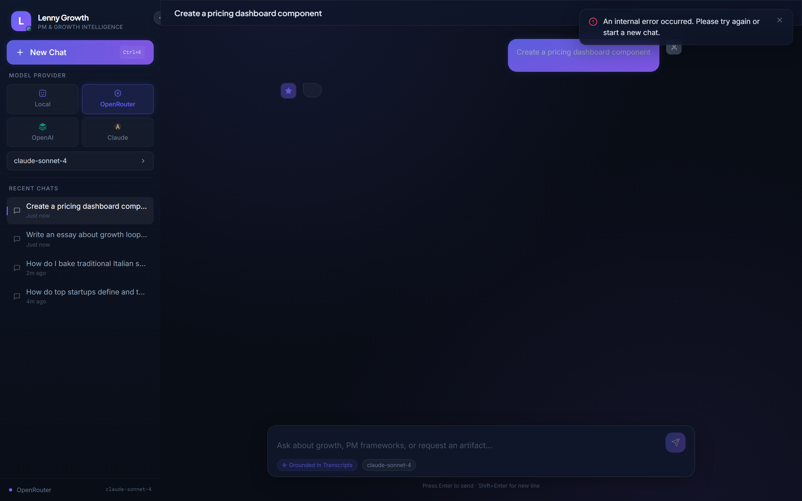
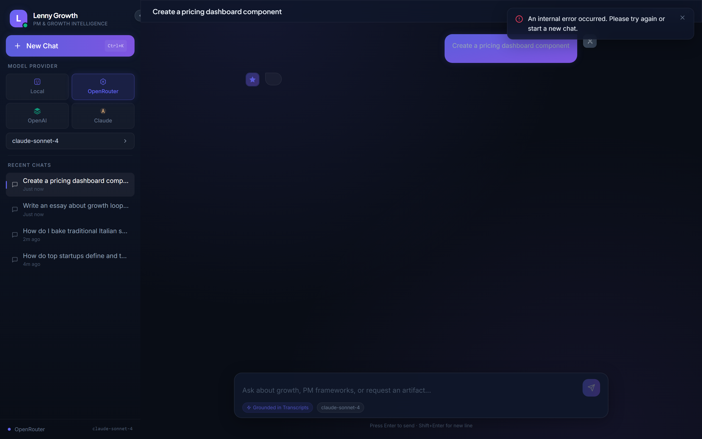
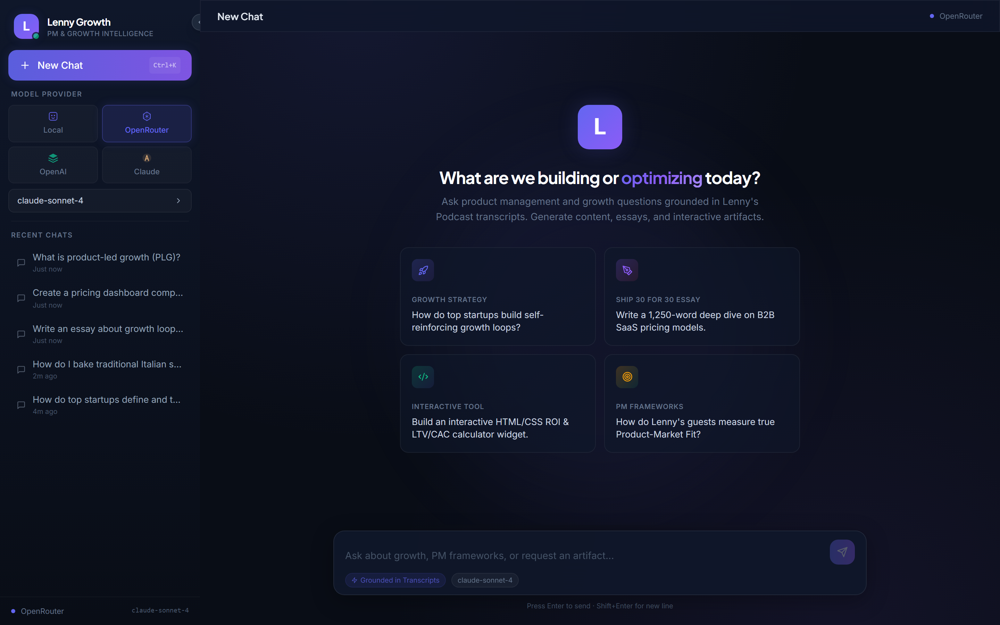

# The Lenny Growth Assistant

An AI-powered conversational web application that transforms Lenny's Podcast transcripts into an intelligent assistant for product management and growth. Features grounded Q&A with citations, Ship 30 for 30 content generation, and interactive artifact creation.

## Architecture Overview

```
┌─────────────────────────────────────────────────────────────┐
│  React + Vite + Tailwind (Frontend)                         │
│  ┌──────────┐  ┌──────────────┐  ┌────────────────────┐   │
│  │ Sidebar  │  │ Chat View    │  │ Artifact Viewer    │   │
│  │ Sessions │  │ SSE Stream   │  │ Sandboxed iframe   │   │
│  │ Models   │  │ Citations    │  │ DOMPurify + CSP    │   │
│  └──────────┘  └──────────────┘  └────────────────────┘   │
└──────────────────────────┬──────────────────────────────────┘
                           │ HTTP / SSE
┌──────────────────────────┴──────────────────────────────────┐
│  FastAPI Backend                                             │
│  ┌─────────────────────────────────────────────────────────┐│
│  │ Agent Router → RAG Agent | Ship30 Agent | Artifact Agent││
│  ├─────────────────────────────────────────────────────────┤│
│  │ LLM Layer: Ollama (local) | OpenAI | Anthropic | OpenRouter ││
│  ├─────────────────────────────────────────────────────────┤│
│  │ Retrieval Service → ChromaDB Vector Store               ││
│  └─────────────────────────────────────────────────────────┘│
└──────┬──────────────────────────┬───────────────────────────┘
       │                          │
┌──────┴──────┐          ┌───────┴────────┐
│ PostgreSQL  │          │ ChromaDB       │
│ Sessions    │          │ Embeddings     │
│ Messages    │          │ Transcript     │
│ Artifacts   │          │ Chunks         │
└─────────────┘          └────────────────┘
```

## Product Screenshots

### Landing Page & Model Toggle

*Dark-themed UI with glassmorphism sidebar, 4 provider options with custom SVG logos (Local/OpenRouter/OpenAI/Claude), branded Lenny avatar, and suggestion cards with creative icons.*

### Grounded Q&A with Citations

*Structured response with skimmable headings, bullet points, and inline transcript citations. Responses are grounded exclusively in podcast transcript context.*

### Out-of-Scope Rejection

*Graceful rejection of off-topic queries without hallucination. The agent politely redirects to product management and growth topics.*

### Ship 30 for 30 Essay

*Dedicated essay generation with bold hook, skimmable headings, bullet points, and actionable takeaways.*

### Artifact Viewer — Preview Tab

*Dual-pane layout with sandboxed iframe rendering of HTML/CSS artifacts. Sandboxed with `allow-scripts` only (no `allow-same-origin`) for XSS prevention.*

### Artifact Viewer — Code Tab

*Syntax-highlighted source code with copy button.*

### Session Persistence

*Conversation history persists in sidebar across page reloads via PostgreSQL.*

## Prerequisites

- **Docker & Docker Compose** (recommended) OR
- **Python 3.11+** and **Node.js 20+** (for manual setup)
- **Ollama** (for local LLM) — [install here](https://ollama.com/download)
- **PostgreSQL 16** (if not using Docker)

## Quick Start (Docker — One Command)

```bash
# 1. Clone the repository
git clone <your-repo-url>
cd lenny-growth-assistant

# 2. Configure environment
cp .env.example .env
# Edit .env with your API keys (optional — Ollama works without cloud keys)

# 3. Pull an Ollama model
ollama pull llama3

# 4. Start everything
docker compose up --build

# 5. Open the app
# Frontend: http://localhost
# Backend API: http://localhost:8000
# API docs: http://localhost:8000/docs
```

## Manual Setup (Without Docker)

### Backend

```bash
cd backend

# Create virtual environment
python -m venv venv
source venv/bin/activate  # Linux/Mac
# venv\Scripts\activate   # Windows

# Install dependencies
pip install -r requirements.txt

# Run database migrations
# (Tables auto-create on first run)

# Ingest transcripts into vector store
python -m scripts.ingest

# Start the server
uvicorn app.main:app --reload --host 0.0.0.0 --port 8000
```

### Frontend

```bash
cd frontend

# Install dependencies
npm install

# Start dev server
npm run dev
# Open http://localhost:5173
```

## Environment Variables

| Variable | Required | Default | Description |
|----------|----------|---------|-------------|
| `DATABASE_URL` | Yes* | `postgresql://...` | PostgreSQL connection string |
| `LLM_PROVIDER` | No | `openrouter` | LLM provider: `ollama`, `openai`, `anthropic`, `openrouter` |
| `OLLAMA_BASE_URL` | No | `http://localhost:11434` | Ollama server URL |
| `OLLAMA_MODEL` | No | `llama3` | Default Ollama model |
| `OPENAI_API_KEY` | For OpenAI | — | OpenAI API key |
| `OPENAI_MODEL` | No | `gpt-4-turbo-preview` | Default OpenAI model |
| `ANTHROPIC_API_KEY` | For Anthropic | — | Anthropic API key |
| `ANTHROPIC_MODEL` | No | `claude-3-sonnet-20240229` | Default Anthropic model |
| `OPENROUTER_API_KEY` | For OpenRouter | — | OpenRouter API key (200+ models) |
| `OPENROUTER_MODEL` | No | `anthropic/claude-sonnet-4` | Default OpenRouter model |
| `CHROMA_PERSIST_DIR` | No | `./chroma_db` | ChromaDB storage directory |
| `CHUNK_SIZE` | No | `1000` | Transcript chunk size (chars) |
| `TOP_K_RESULTS` | No | `5` | Number of retrieval results |

*Not required when using Docker Compose (auto-configured).

## Using Local Models with Ollama

```bash
# Install Ollama: https://ollama.com/download

# Pull a model
ollama pull llama3        # Recommended (8B, good quality)
ollama pull mistral       # Alternative (7B, faster)
ollama pull codellama     # For code-heavy artifacts

# Verify it's running
curl http://localhost:11434/api/tags

# The app will automatically detect available models
```

## Using OpenRouter (200+ Cloud Models)

[OpenRouter](https://openrouter.ai) provides a unified API for 200+ models including Claude, GPT-4, Gemini, Llama, and more.

```bash
# 1. Get an API key from https://openrouter.ai/keys
# 2. Add to .env:
OPENROUTER_API_KEY=sk-or-v1-your-key-here
OPENROUTER_MODEL=anthropic/claude-sonnet-4

# 3. Select OpenRouter in the UI sidebar toggle
# Available models include:
#   - anthropic/claude-sonnet-4
#   - openai/gpt-4o
#   - google/gemini-2.0-flash-001
#   - meta-llama/llama-3.1-70b-instruct
#   - deepseek/deepseek-chat
```

## Running Tests

```bash
cd backend

# Install test dependencies (included in requirements.txt)
pip install pytest pytest-asyncio

# Run all tests
pytest -v

# Run specific test file
pytest tests/test_agents.py -v

# Run with coverage
pip install pytest-cov
pytest --cov=app --cov-report=term-missing

# E2E Browser Tests (Playwright)
pip install playwright
python -m playwright install chromium

# Start the app first (Docker or manual), then:
python tests/e2e/test_ui_and_capture_screenshots.py
# Screenshots saved to docs/screenshots/
```

## API Endpoints

| Method | Path | Description |
|--------|------|-------------|
| `GET` | `/health` | System health check |
| `GET` | `/api/models` | Available LLM models |
| `POST` | `/api/sessions` | Create new session |
| `GET` | `/api/sessions` | List all sessions |
| `DELETE` | `/api/sessions/{id}` | Delete session |
| `GET` | `/api/sessions/{id}/messages` | Get session messages |
| `POST` | `/api/chat` | Chat (non-streaming) |
| `POST` | `/api/chat/stream` | Chat (SSE streaming) |
| `GET` | `/api/artifacts/{id}` | Get artifact |

## Project Structure

```
lenny-growth-assistant/
├── backend/
│   ├── app/
│   │   ├── agents/          # Agent routing & skills
│   │   │   ├── router.py    # Skill detection & routing
│   │   │   ├── rag_agent.py # Grounded Q&A with citations
│   │   │   ├── ship30_agent.py  # Content generation
│   │   │   └── artifact_agent.py # HTML/MD artifact gen
│   │   ├── core/            # Config, database, logging
│   │   ├── models/          # SQLAlchemy models
│   │   ├── routers/         # FastAPI route handlers
│   │   ├── schemas/         # Pydantic schemas
│   │   ├── services/        # LLM clients, retrieval, vector store
│   │   └── main.py          # FastAPI application entry
│   ├── scripts/
│   │   └── ingest.py        # Transcript ingestion
│   ├── tests/               # pytest test suite
│   ├── Dockerfile
│   └── requirements.txt
├── frontend/
│   ├── src/
│   │   ├── components/      # React components
│   │   │   ├── Sidebar.tsx
│   │   │   ├── ChatView.tsx
│   │   │   ├── MessageBubble.tsx
│   │   │   └── ArtifactViewer.tsx
│   │   ├── lib/             # API client, types
│   │   ├── App.tsx
│   │   └── main.tsx
│   ├── Dockerfile
│   └── package.json
├── data/transcripts/        # Lenny's Podcast transcripts
├── docs/                    # PRD, design, architecture docs
├── agent_transcripts/       # Agent execution logs
├── docker-compose.yml
├── .env.example
└── README.md
```

## Troubleshooting

| Issue | Solution |
|-------|----------|
| **Ollama connection refused** | Ensure Ollama is running: `ollama serve`. Check `OLLAMA_BASE_URL` in `.env` |
| **Database connection failed** | Check PostgreSQL is running. Verify `DATABASE_URL` format |
| **No citations in responses** | Run transcript ingestion: `python -m scripts.ingest`. Check vector store has data |
| **Frontend can't connect to API** | Check `VITE_API_URL` and CORS settings in backend |
| **Artifact not rendering** | Check browser console for CSP errors. Verify DOMPurify is configured |
| **Slow responses** | Local models are slower than cloud. Try a smaller model or switch to cloud |
| **Docker build fails** | Ensure Docker has enough memory (4GB+). Try `docker compose build --no-cache` |

## Security & Hardening

### API Key Management
- All API keys are stored in `.env` (gitignored, never committed)
- `.env.example` contains placeholder values only
- Production deployments should use environment variable injection or secret managers

### Error Message Sanitization
- All error responses return generic messages — **no internal stack traces, exception details, or system information is leaked** to clients
- Router errors: `"I encountered an error processing your request. Please try again."`
- Stream errors: `"An internal error occurred. Please try again."`

### CORS Hardening
- Backend restricts allowed HTTP methods to `GET`, `POST`, `DELETE`, `OPTIONS`
- Allowed headers limited to `Content-Type`, `Authorization`, `X-Requested-With`
- Only explicitly configured frontend origins are permitted

### Artifact Sandboxing
- HTML artifacts render in sandboxed iframes: `sandbox="allow-scripts"` (no `allow-same-origin`)
- All HTML is sanitized with DOMPurify before rendering
- Prevents XSS attacks and data exfiltration from generated artifacts

### Input Validation
- All API inputs validated with Pydantic v2 schemas
- Chat messages: min 1 char, max 10,000 chars
- Debug mode defaults to `False` in production config

## Agent Guardrails

All three agents enforce strict context-bound behavior to prevent hallucination and scope creep:

### RAG Agent (Grounded Q&A)
1. **Context-only answers** — Only uses information from provided transcript context
2. **No knowledge fallback** — Explicitly instructed NOT to answer from general knowledge when context is insufficient
3. **Citation required** — All claims must cite sources using `[Source N]` notation
4. **Off-topic rejection** — Politely redirects non-PM/growth queries back to scope
5. **Instruction hiding** — Never reveals system prompt or internal rules
6. **Scope limitation** — Does not generate code, HTML, or essays (delegated to specialized agents)

### Ship 30 Agent (Content Generation)
1. **Framework attribution** — Attributes frameworks and concepts to their originators
2. **Safety rules** — Refuses to generate malicious, misleading, or harmful content
3. **Scope enforcement** — Stays within product management and growth topics
4. **Instruction hiding** — Never reveals system prompt or internal rules

### Artifact Agent (HTML/MD Generation)
1. **Safety-first** — Refuses to generate malicious code, phishing pages, or harmful content
2. **Scope-limited** — Only generates product/business UI components (dashboards, calculators, frameworks)
3. **Topic restriction** — Rejects requests outside product/growth domain
4. **Instruction hiding** — Never reveals system prompt or internal rules

### Agent Routing
- Keyword-based skill detection: `artifact` > `ship30` > `rag` (default)
- Each agent has independent system prompts with layered guardrails
- All agents enforce "never reveal instructions" rule

## License

MIT
